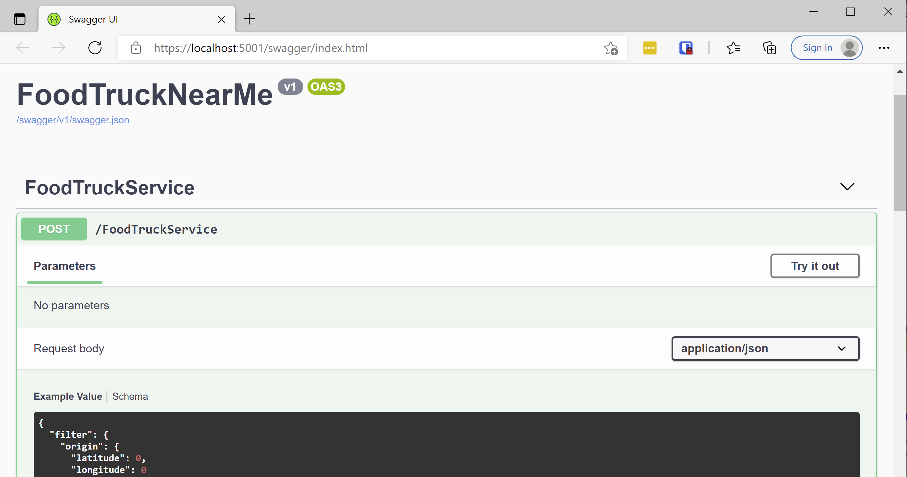

# FoodTrucksNearMe  
[Design](./Docs/design.md)  

## QuickStart
1. Run the FoodTruckNearMe app (NOT the DOCKER VERSION)

  

2. Try it out and post the following request  

```json
{
  "filter": {
    "origin": {
      "latitude": 37.78844615690132,
        "longitude": -122.3986412420388
    },
    "status": "APPROVED"
  },
  "pagination": {
    "limit": 1,
    "nextToken": ""
  }
}
```  
3. Response should be
```json
{
  "origin": {
    "latitude": 37.78844615690132,
    "longitude": -122.3986412420388
  },
  "paginationResponse": {
    "totalAvailable": true,
    "total": 131,
    "limit": 1,
    "nextToken": "1",
    "done": false
  },
  "mobileFoodFacilityPermits": [
    {
      "distance": 0,
      "permit": {
        "locationid": 1524388,
        "applicant": "Flavors of Africa",
        "facilityType": "Truck",
        "cnn": 0,
        "locationDescription": "MISSION ST: SHAW ALY to ANTHONY ST (543 - 586)",
        "address": "555 MISSION ST",
        "blocklot": 0,
        "block": 0,
        "lot": 0,
        "permit": null,
        "status": "APPROVED",
        "foodItems": "Meat and vegi rice bowls: meat and vegi salad bowls: meat and vegi wraps: drinks and juices.",
        "x": 0,
        "y": 0,
        "latitude": 37.78844615690132,
        "longitude": -122.3986412420388,
        "schedule": "http://bsm.sfdpw.org/PermitsTracker/reports/report.aspx?title=schedule&report=rptSchedule&params=permit=21MFF-00068&ExportPDF=1&Filename=21MFF-00068_schedule.pdf",
        "dayshours": "",
        "noiSent": null,
        "approved": "0001-01-01T00:00:00",
        "received": 0,
        "priorPermit": 0,
        "expirationDate": "0001-01-01T00:00:00",
        "location": null,
        "firePreventionDistricts": 0,
        "policeDistricts": 0,
        "supervisorDistricts": 0,
        "zipCodes": 0,
        "neighborhoodsold": 0
      }
    }
  ]
}
```
## Pagination
The current design of the pagination flow is that a null or empty token is sent to start it off;
```json
 "pagination": {
    "limit": 1,
    "nextToken": ""
  }
```
Here we are asking for 1 record starting from the beginning.  
The pagination response for subsequent calls are to send the nextToken from a response as the nextToken in the following request.  
```json
"paginationResponse": {
    "totalAvailable": true,
    "total": 131,
    "limit": 1,
    "nextToken": "1",
    "done": false
  }
```
The nextToken is oqaque, and in this design it is simple ```{skip}```.   

The next request would look like this;  
```json
{
  "filter": {
    "origin": {
      "latitude": 37.788530010632506,
        "longitude": -122.39514429387364
    },
    "status": "APPROVED"
  },
  "pagination": {
    "limit": 1,
    "nextToken": "1"
  }
}
```  
 
